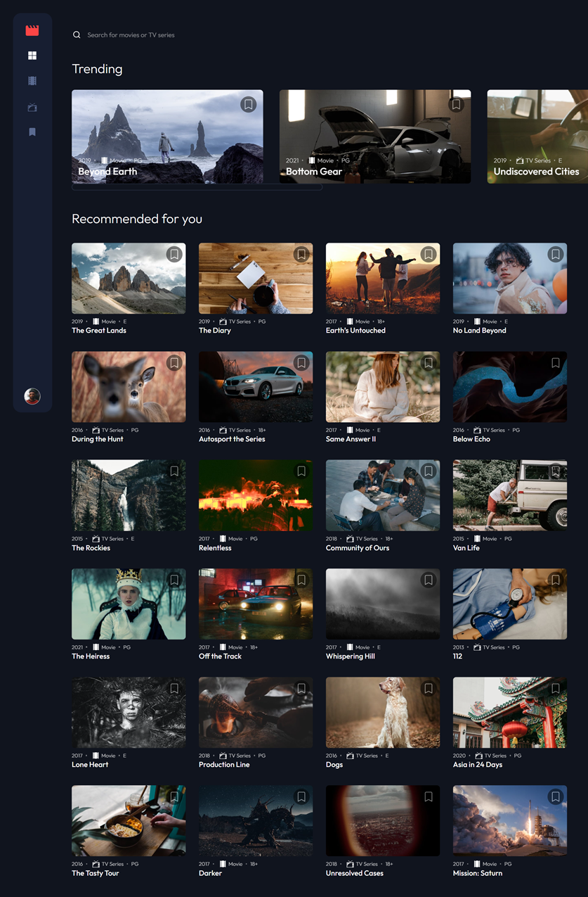
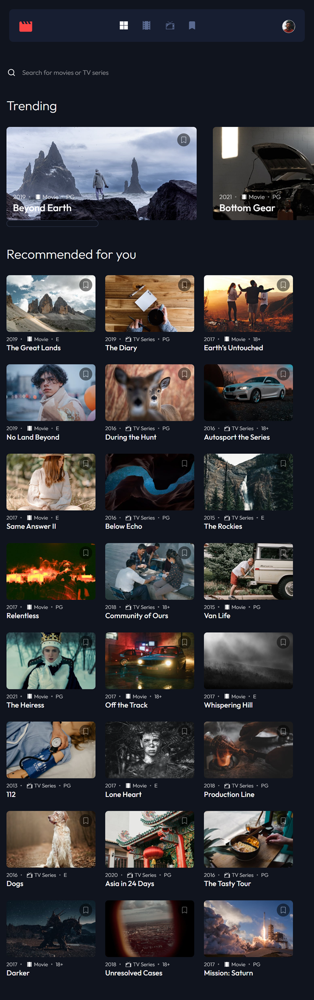
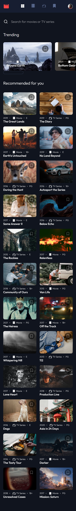

# Frontend Mentor - Entertainment web app solution

This is a solution to the [Entertainment web app challenge on Frontend Mentor](https://www.frontendmentor.io/challenges/entertainment-web-app-J-UhgAW1X). Frontend Mentor challenges help you improve your coding skills by building realistic project.

## Table of contents

- [Overview](#overview)
  - [The challenge](#the-challenge)
  - [Screenshot](#screenshot)
  - [Links](#links)
- [My process](#my-process)
  - [Built with](#built-with)
  - [What I learned](#what-i-learned)
  - [Continued development](#continued-development)
  - [Useful resources](#useful-resources)
- [Author](#author)
- [Acknowledgments](#acknowledgments)

## Overview

### The challenge

Users should be able to:

- View the optimal layout for the app depending on their device's screen size
- See hover states for all interactive elements on the page
- Navigate between Home, Movies, TV Series, and Bookmarked Shows pages
- Add/Remove bookmarks from all movies and TV series
- Search for relevant shows on all pages
- **Bonus**: Build this project as a full-stack application
- **Bonus**: If you're building a full-stack app, we provide authentication screen (sign-up/login) designs if you'd like to create an auth flow

### Screenshot

## Desktop

## Tablet

## Mobile

### Links

- Solution URL: [https://github.com/kamiliano1/entertainment-web-app](https://github.com/kamiliano1/entertainment-web-app)
- Live Site URL: [https://entertainment-web-app-kwtj-mzp6x2u7s-kamiliano1.vercel.app/](https://entertainment-web-app-kwtj-mzp6x2u7s-kamiliano1.vercel.app/)

## My process

### Built with

- Semantic HTML5 markup
- CSS custom properties
- Flexbox
- Mobile-first workflow
- localStorage - for keeping bookmarked movies or TV series
- React useContext
- [React](https://reactjs.org/) - JS library
- [react-icons](https://react-icons.github.io/react-icons/) - React Icons
- [Next.js](https://nextjs.org/) - React framework
- [Chakra UI](https://chakra-ui.com/)
- [Firebase](https://firebase.google.com/) - for sign up and log in
- [React Hook Form](https://react-hook-form.com/) - For input form

### What I learned

During this challenge first time, I was working with Firebase and Chakra UI.
When I was building the project I got knowledge of how to use Chakra UI.

I had a problem with importing provided SVG icons with Chakra UI and because of that, I used icons from react-icons.

### Useful resources

- [Code a Reddit Clone with React, Next.js, Firebase v9, Chakra UI – Full Course](https://www.youtube.com/watch?v=rCm5RVYKWVg&t=28649s) - This course helped me with Chakra UI but mostly with how to implement Firebase to this project.

## Author

- Website - [Kamil Szymon](https://github.com/kamiliano1)
- Frontend Mentor - [@kamiliano1](https://www.frontendmentor.io/profile/kamiliano1)

## Acknowledgments

As I mentioned before I want to thank you for the Reddit clone course. It was much helpful when I was working on this project. It showed step-by-step how to start working with firebase and how to use it.
